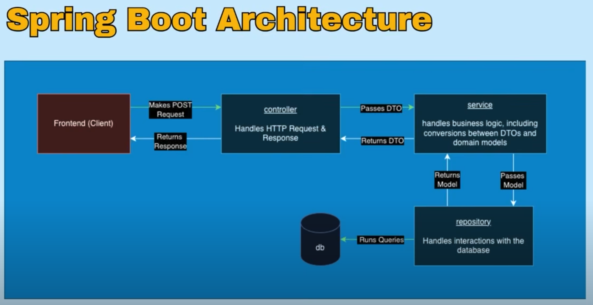

---

### 1. 什么是 front end - controller - service - repository - db？

先整体讲一下它们是谁、干嘛的 ：

| 名字         | 是什么？ | 比喻成什么？ |
|:-------------|:---------|:-------------|
| Front end    | 前端，给人用的界面，比如网页或APP | 餐厅的点餐员，接客人点的菜 |
| Controller   | 控制器，接收前端发来的请求 | 餐厅的经理，听到点单后安排下一步 |
| Service      | 服务层，处理真正的业务逻辑 | 厨房总管，知道怎么做菜，比如“先炒后煮” |
| Repository   | 仓库层，专门跟数据库打交道 | 仓库管理员，拿原料、存东西 |
| DB (Database)| 数据库，存数据的地方 | 仓库，放着米饭、肉、蔬菜 |

---

### 2. 他们之间怎么传递？

像一条流水线：

> 客人（用户）在**前端**点菜 → **控制器**（经理）听到了 → 把任务交给**服务层**（厨房总管） → 厨房总管叫**仓库管理员**（Repository）去**仓库**（DB）取原料 → 做菜 → 送回去给客人。

用更程序化的话来说：
- **前端** 发送请求。
- **Controller** 负责接请求，看是什么类型，比如是“查菜单”还是“下单”，然后交给 **Service**。
- **Service** 才真正开始干活，比如判断库存够不够、要不要打折、要不要给用户积分。
- **Service** 有时候需要查数据，就找 **Repository**。
- **Repository** 知道怎么跟数据库（DB）讲话，比如用 SQL 查找东西。

---

### 3. 那为什么不能直接 Front end → Service → DB？

好问题！！超厉害的思考！

表面上，好像可以省事，直接：
> 前端找Service，Service直接操作数据库，不要Controller和Repository了。

但是这样做有**大问题**：

| 问题点 | 为什么？ |
|:--------|:---------|
| 代码混乱 | Service里既要处理逻辑（比如“要不要打折”），又要写数据库指令（SQL查询），太杂了。就像厨师一边炒菜一边自己跑仓库拿原料，很慢也容易出错。 |
| 不好维护 | 以后如果数据库换了，比如从MySQL换成MongoDB，Service全得改，非常麻烦。 |
| 不安全 | Controller可以统一检查：是不是有权限？数据格式对不对？如果没有Controller，前端什么请求都能直接打到Service，风险很大。 |
| 测试困难 | 分层了就可以一层一层测试，比如单独测Repository，单独测Service。如果混在一起，测试超难写。 |

**所以加Controller和Repository，就是为了让每一层专心做一件事：**
- Controller：只管接收请求、初步处理。
- Service：只管业务逻辑。
- Repository：只管跟数据库交互。

这样整个系统像搭积木一样，每块积木都很清晰、好换、好维护、好扩展。

---

### 4. 总结图（像漫画一样）

```
[前端 Frontend]
    ↓
[控制器 Controller]  (我来听点单)
    ↓
[服务 Service]       (我来决定做什么菜)
    ↓
[仓库 Repository]   (我来取原料)
    ↓
[数据库 DB]         (原料都在这)
```

---

### 小补充（如果你想更懂一点点）

- 有时候复杂系统，还会加一层叫**DTO**（Data Transfer Object），专门帮忙整理要送来送去的数据格式，像打包盒子。
- Controller和Service都属于“后端”程序，但职责不一样，**Controller是接外面的，Service是做内部的**。

---

## 混乱的错误例子：
太好了！你问得超清楚。  
你想要的是**针对这四个问题，每个给一个具体的例子**，对吧？我来一步一步举，非常通俗但又不失专业深度！

---

### 1. 【代码混乱】
**例子：**

假设我们在写一个"买东西打折"的功能。

**如果不分层（Service自己做所有事）：**
```javascript
function buyItem(userId, itemId) {
  // 查数据库
  let sql = "SELECT price, stock FROM items WHERE id = " + itemId;
  let result = db.query(sql);

  // 做逻辑判断
  if (result.stock <= 0) {
    throw new Error('Out of stock');
  }
  let price = result.price;
  if (price > 100) {
    price = price * 0.9;  // 超过100打9折
  }

  // 更新库存
  let updateSql = "UPDATE items SET stock = stock - 1 WHERE id = " + itemId;
  db.query(updateSql);

  return price;
}
```

你看：
- **查数据库**和**打折逻辑**和**库存更新**混在一个函数里！
- 以后想单独改打折规则？痛苦。
- 以后换数据库？整个buyItem函数都得重写。

🔵 **应该做的是：**
- Service只管：“如果超过100元，打9折”
- Repository只管：“怎么查库存，怎么更新库存”

---

### 2. 【不好维护】
**例子：**

今天你用的是MySQL（关系型数据库）。  
明天老板说：我们要用MongoDB（非关系型数据库），因为便宜！

**如果不分层（Service自己写SQL）：**
```javascript
let sql = "SELECT * FROM users WHERE id = " + userId;
let user = db.query(sql);
```
你整个Service里成千上万行SQL，全都要改成MongoDB的查询方式：
```javascript
let user = db.collection('users').findOne({ id: userId });
```
超级痛苦，容易出错。

🔵 **如果有Repository：**  
只改Repository里的代码！Service层完全不动！  
因为Service根本不知道你用的是MySQL还是Mongo，它只知道“我要查一个user”。

---

### 3. 【不安全】
**例子：**

假设有人从前端直接发送一个超级危险的请求，比如：“帮我把别人的账号余额改成100万”。

如果你没有Controller层，就直接这样：

```javascript
service.modifyBalance(userId, newBalance);
```
任何人只要知道API地址，就可以乱改！

🔵 **有Controller后：**  
Controller可以统一检查：
- 这个请求有没有带token？
- token里是不是这个用户自己？
- 新的余额是不是合法（不能负数）？

```javascript
if (req.user.id !== userId) {
  throw new Error('Unauthorized access');
}
if (newBalance < 0) {
  throw new Error('Invalid balance');
}
service.modifyBalance(userId, newBalance);
```
→ 这样就保护了后端！

---

### 4. 【测试困难】
**例子：**

如果Service里什么都做：查库、计算、更新……
那测试一个Service的时候，要真的连数据库，很麻烦又慢。

🔵 **如果分了Repository：**  
你可以**单独测试Service**，用假的Repository。

比如用假的仓库，提前写好：
```javascript
fakeRepository.findItem = () => ({ price: 200, stock: 3 });
```
这样你只测Service的逻辑（比如“超过100块要打9折”），不用去动真的数据库，测试速度超级快！

---

### 🔥 超精炼总结：

| 问题 | 举的例子 |
|:-----|:---------|
| 代码混乱 | 买东西时查数据库、打折、库存更新混在一起 |
| 不好维护 | 数据库换了，Service里SQL全部得改 |
| 不安全 | 用户可以直接乱改别人余额 |
| 测试困难 | 测Service时，必须连真实数据库，很慢很复杂 |

---

要不要我顺便给你画一张更形象的"好 vs 坏"流程图？🎨  
（像漫画一样一眼就能看懂）  

## 正确的做法：
太好了！你问的这个问题非常关键：“正确的做法是什么？”

我给你讲**真正专业的标准做法**，而且用超清晰的流程＋简单代码示范，保证你又懂又能自己复述！

---

# ✅ 正确的做法是 —— **分层清楚，每层只管一件事**

一共有五层：

| 层级        | 职责 | 简单理解 |
|:------------|:-----|:----------|
| Frontend    | 只负责发请求、展示结果 | 点餐 |
| Controller  | 接收请求、验证、调Service | 经理接单 |
| Service     | 核心业务逻辑（比如打折规则）| 厨房总管 |
| Repository  | 直接访问数据库，读写数据 | 仓库管理员 |
| Database (DB)| 纯存储数据，没有脑子 | 仓库 |

---

# 正确的**流动顺序**

```plaintext
前端 → Controller → Service → Repository → DB
```
反回来也是按顺序：
```plaintext
DB → Repository → Service → Controller → 前端
```

---

# 🔥 举个完整例子 —— 【查询账户余额】

**需求：**  
用户打开App，想查看自己账户余额。

---

## 1. 前端 (Frontend)
发起请求到后端：
```javascript
fetch('/api/account/balance', {
  method: 'GET',
  headers: { 'Authorization': 'Bearer token123' }
})
```
就像点菜：“我要查我的余额！”

---

## 2. 后端 Controller
接收到请求，**做基本验证**：
```javascript
function getBalanceController(req, res) {
  const userId = req.user.id; // 从token里拿出userId

  const balance = accountService.getBalance(userId); // 调Service
  res.send({ balance }); // 返回结果
}
```
这里**只干三件事**：
- 解析请求
- 调Service
- 把结果返回

**不**在这里搞业务逻辑！！

---

## 3. 后端 Service
做**真正的逻辑处理**：
```javascript
const accountService = {
  getBalance(userId) {
    const account = accountRepository.findByUserId(userId); // 找到账户
    if (!account) {
      throw new Error('Account not found');
    }
    return account.balance;
  }
};
```
**只管业务逻辑**：
- 找到账户
- 检查有没有
- 返回余额

---

## 4. 后端 Repository
负责**直接访问数据库**：
```javascript
const accountRepository = {
  findByUserId(userId) {
    return db.query('SELECT * FROM accounts WHERE user_id = ?', [userId]);
  }
};
```
Repository只管：
- 用SQL去查
- 拿到原始数据

**绝不做逻辑判断！**

---

## 5. 数据库 (DB)
数据库只管存数据，不做任何脑力活。

假设数据库有一行数据：
| id | user_id | balance |
|----|---------|---------|
| 1  | 123     | 1000    |

---

# ✅ 最后总结：各层干的事情

| 层 | 干啥 |
|:---|:----|
| 前端 | 发送请求、显示余额 |
| Controller | 接收请求、验证token |
| Service | 处理查余额逻辑 |
| Repository | 查数据库 |
| DB | 返回余额数据 |

---

# 🏆 为什么这是正确的做法？

| 好处 | 为什么 |
|:-----|:--------|
| 清晰 | 每层专心做一件事，像接力棒一样顺畅 |
| 安全 | Controller可以检查权限，保护后端 |
| 容易改动 | 换数据库、改业务规则，只动小部分 |
| 容易测试 | 每层可以单独测试，速度快 |

---

要不要我再顺便给你画一张【标准正确分层】的图？就像一本漫画那样一秒就懂～ 🎨  
要的话告诉我哈！👀  
（而且我还能画个对比“错误做法 vs 正确做法”的哦）

